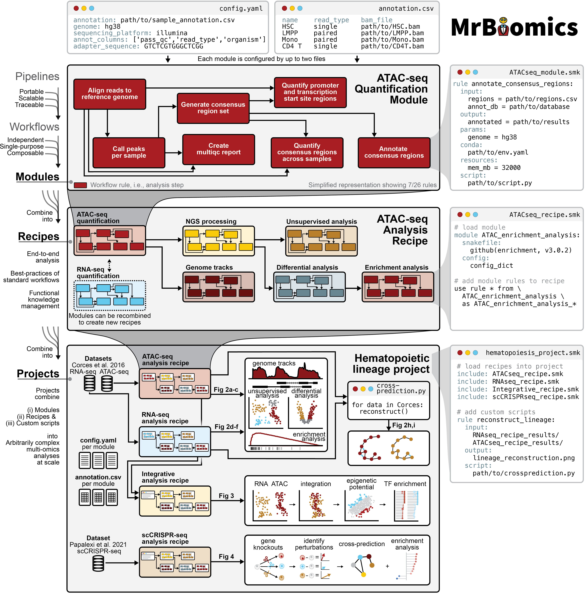

# 🚀🧬 MrBiomics: <ins>M</ins>odules & <ins>R</ins>ecipes augment <ins>Bio</ins>informatics for Multi-<ins>Omics</ins> Analyses
> _"For many outcomes, roughly 80% of consequences come from 20% of causes (the "vital few")."_ - The Pareto Principle by Vilfredo Pareto

Get 80% of all standard (biomedical) data science analyses done semi-automated with 20% of the effort, by leveraging [Snakemake's](https://snakemake.github.io/) module functionality to use and combine pre-existing workflows into arbitrarily complex analyses.

> [!IMPORTANT]  
> If you use **MrBiomics**, please don't forget to give credit to the authors by citing this original repository and the respective **Modules** and **Recipes**.

# ⏳ TL;DR - More Time for Science!
> _"Programming is about trying to make the future less painful. It’s about making things easier for our teammates."_ from _The Pragmatic Programmer_ by Andy Hunt & Dave Thomas
- **Why**: Time is the most precious resource. By taking care of efficiency (i.e., maximum output with limited resources) scientists can re-distribute their time to focus on effectiveness (i.e., the biggest impact possible).
- **How**: **Systematic Functional Knowledge Management**. Leverage the latest developments in workflow management to (re-)use and combine independent computational modules into arbitrarily complex analyses to benefit from modern innovation methods (e.g., fast prototyping, design thinking, and agile concepts).
- **What**: **Independent** and **single-purpose** computational **Modules**, implemented as Snakemake workflows, encode standard approaches that are used to scale, automate, and parallelize analyses. **Recipes** combine modules into end-to-end best practice workflows, thereby accelerating analyses to the point of the unknown. Snakemake's module functionality enables **Projects** to combine modules, recipes and custom code into arbitrarily complex multi-omics analyses at scale. 

 *Illustration of MrBiomics Modules, Recipes and Projects*

> [!NOTE]  
> Altogether this enables complex, portable, transparent, reproducible, and documented analyses of multi-mics data at scale.

# 🧠 Functional Knowledge Management
> _"The best documentation is automation."_ - Wise Person on the Internet

**Functional Knowledge Management (FKM)** is our knowledge-management approach in which validated best practices are captured as executable software functions, modules, or recipes.
- Each artefact simultaneously **documents** the know-how and **performs** the task, creating a living, testable, and composable code collection that closes the gap between theory and practice.
- Rigorous **modularity and version control** keep every function self-contained, tested, and repository-tracked, enabling safe reuse and continuous evolution.
- As a **compounding asset base** new functions can be built on earlier ones, steadily expanding an ever-richer compendium of trusted solutions.

# 🧩 Modules
> _"Is it functional, multifunctional, durable, well-fitted, simple, easy to maintain, and thoroughly tested? Does it provide added value, and doesn't cause unnecessary harm? Can it be simpler? Is it an innovation?"_ - Patagonia Design Principles

**Modules** are Snakemake workflows, consisting of **Rules** for multi-step analyses, that are **independent**, **single-purpose**, and sufficiently abstracted to be **compatible** with most up- and downstream analyses. A `{module}` can be general-purpose (e.g., Unsupervised Analysis) or modality-specific (e.g., ATAC-seq processing). Currently, the following **eleven modules** are available, roughly ordered by their applicability from general to specific:

| Module | Type (Data Modality) | DOI | Version | Stars |
| :---: | :---: | :---: | :---: | :---: |
| [Unsupervised Analysis](https://github.com/epigen/unsupervised_analysis) | General Purpose<br>(tabular data) | [](https://zenodo.org/badge/latestdoi/475465311) |  |  |
| [Fetch NGS Data and Metadata using iSeq](https://github.com/epigen/fetch_ngs) | Bioinformatics<br>(NGS data) | [](https://doi.org/10.5281/zenodo.15005419) |  | 
| [Split, Filter, Normalize and Integrate Sequencing Data](https://github.com/epigen/spilterlize_integrate) | Bioinformatics<br>(NGS counts) | [](https://zenodo.org/badge/latestdoi/659800258) |  |  |
| [Differential Analysis with limma](https://github.com/epigen/dea_limma) | Bioinformatics<br>(NGS data) | [](https://zenodo.org/badge/latestdoi/524038188) |  | 
| [Enrichment Analysis](https://github.com/epigen/enrichment_analysis) | Bioinformatics<br>(genes/genomic regions) | [](https://zenodo.org/badge/latestdoi/377527671) |  |  |
| [Genome Track Visualization](https://github.com/epigen/genome_tracks) | Bioinformatics<br>(aligned BAM files) | [](https://zenodo.org/doi/10.5281/zenodo.10849097) |  |  |
| [ATAC-seq Processing, Quantification & Annotation](https://github.com/epigen/atacseq_pipeline) | Bioinformatics<br>(ATAC-seq) | [](https://zenodo.org/doi/10.5281/zenodo.6323634) |  |  |
| [RNA-seq Processing, Quantification & Annotation](https://github.com/epigen/rnaseq_pipeline) | Bioinformatics<br>(RNA-seq) | [](https://zenodo.org/doi/10.5281/zenodo.15119355) |  |  |
| [scRNA-seq Processing using Seurat](https://github.com/epigen/scrnaseq_processing_seurat) | Bioinformatics<br>(scRNA-seq) | [](https://zenodo.org/doi/10.5281/zenodo.10679327) |  |  |
| [Differential Analysis using Seurat](https://github.com/epigen/dea_seurat) | Bioinformatics<br>(scRNA-seq) | [](https://zenodo.org/doi/10.5281/zenodo.10689139) |  |  |
| [Perturbation Analysis using Mixscape from Seurat](https://github.com/epigen/mixscape_seurat) | Bioinformatics<br>(scCRISPR-seq) | [](https://zenodo.org/badge/latestdoi/481635018) |  |  |

> [!NOTE]  
> ⭐️ **Star and share modules you find valuable** 📤 — help others discover them, and guide our future work!

> [!TIP]
> For detailed instructions on the [installation](../../wiki/Installation), [configuration](../../wiki/Configuration), and [execution](../../wiki/Execution) of modules, you can check out the [wiki](https://github.com/epigen/MrBiomics/wiki). Generic instructions are also shown in the modules' respective [Snakmake workflow catalog entry](https://snakemake.github.io/snakemake-workflow-catalog).

# 📋 Projects using multiple Modules
> _“Absorb what is useful. Discard what is not. Add what is uniquely your own.”_ - Bruce Lee

You can [(re-)use and combine pre-existing workflows](https://snakemake.readthedocs.io/en/stable/snakefiles/deployment.html#using-and-combining-pre-exising-workflows) within your projects by loading them as [**Modules**](https://snakemake.readthedocs.io/en/stable/snakefiles/modularization.html#snakefiles-modules) since [Snakemake 6](https://slides.com/johanneskoester/snakemake-6#/8). The combination of multiple modules into projects that analyze multiple datasets represents the overarching vision and power of **MrBiomics**.

> [!NOTE]
> When applied to multiple datasets within a project, each dataset should have its own result directory within the project directory.

Three components are required to use a module within your Snakemake workflow (i.e., a project).
- Configuration: The [`config/config.yaml`](./config/config.yaml) file has to point to the respective configuration files per dataset and workflow.
  ```python
  #### Datasets and Workflows to include ###
  workflows:
      MyData:
          other_workflow: "config/MyData/MyData_other_workflow_config.yaml"
  ```
- Snakefile: Within the main Snakefile ([`workflow/Snakefile`](.workflow/Snakefile)) we have to:
  - load all configurations;
  - include the snakefiles that contain the dataset-specific loaded modules and rules (see next point);
  - and add all modules' outputs to the target's rule `input`.
- Modules: Load the required modules and their rules within separate snakefiles (`*.smk`) in the `rule/` folder. Recommendation: Use one snakefile per dataset.
  ```python
    module MyData_other_workflow:
      # here, plain paths, URLs and the special markers for code hosting providers (e.g., github) are possible.
      snakefile: "other_workflow/Snakefile"
      config: config["MyData_other_workflow"]

    use rule * from MyData_other_workflow as MyData_other_workflow_*
    ```

> [!TIP]
> A full [tutorial](../../wiki/Module-Usage-in-Projects) is available on the [wiki](https://github.com/epigen/MrBiomics/wiki).

# 📜 Recipes
> _"Civilization advances by extending the number of important operations which we can perform without thinking of them."_ - Alfred North Whitehead, author of _Principia Mathematica_

**Recipes** are combinations of existing modules into end-to-end best practice analyses. They can be used as templates for standard analyses by leveraging existing modules, thereby enabling fast iterations and progression into the unknown. Every recipe is described and presented using a [wiki](https://github.com/epigen/MrBiomics/wiki) page by application to a publicly available dataset.

| Recipe | Description | # Modules used |
| :---: | :---: | :---: |
| [RNA-seq Analysis](../../wiki/RNA%E2%80%90seq-Analysis-Recipe) | From raw BAM files to enrichments of differentially expressed genes. | 7 |
| [ATAC-seq Analysis](../../wiki/ATAC%E2%80%90seq-Analysis-Recipe) | From raw BAM files to enrichments of differentially accessible regions. | 7 |
| [Integrative ATAC-seq & RNA-seq Analysis](../../wiki/Integrative-Analysis-Recipe) | From count matrices to enrichments of epigenetic potential and transcriptional abundance. | 4(-7) |
| [scRNA-seq Analysis](../../wiki/scRNA%E2%80%90seq-Analysis-Recipe) (WIP) | From count matrix to enrichments of differentially expressed genes. | 5(-6) |
| [scCRISPR-seq Analysis](../../wiki/scCRISPR%E2%80%90seq-Analysis-Recipe) (WIP) | From count matrix to knockout phenotype enrichments. | 6(-7) |

> [!TIP]
> For detailed instructions make sure to check out our [How to use Recipes](../../wiki/How-to-use-Recipes) guide on the [wiki](https://github.com/epigen/MrBiomics/wiki).

> [!NOTE]  
> ⭐️ **Star this repository and share recipes you find valuable** 📤 — help others find them, and guide our future work!

# 📚 Resources
- [MrBiomics Wiki for instructions & tutorials](https://github.com/epigen/MrBiomics/wiki)
- [GitHub list of MrBiomics modules](https://github.com/stars/sreichl/lists/MrBiomics)
- [My Data Science Setup - A tutorial for developing Snakemake workflows and beyond](http://setup.polytechnist.me)
- [GitHub Page of this repository](https://epigen.github.io/MrBiomics/)
- Curated and published workflows that could be used as modules:
    - [Snakemake Workflow Catalog](https://snakemake.github.io/snakemake-workflow-catalog/)
    - [WorkflowHub](https://workflowhub.eu/)
    - [SnakePipes](https://snakepipes.readthedocs.io/en/latest/index.html)
    - [Seq2Science](https://vanheeringen-lab.github.io/seq2science/index.html)
- Software
    - [Snakemake](https://snakemake.readthedocs.io/en/stable/index.html)
    - [Conda](https://docs.conda.io/en/latest/)
    - [Docker](https://www.docker.com/)
    - [Singularity](https://docs.sylabs.io/guides/3.5/user-guide/index.html#) 

# ⭐ Star History of Modules
[](https://star-history.com/#epigen/atacseq_pipeline&epigen/unsupervised_analysis&epigen/enrichment_analysis&epigen/spilterlize_integrate&epigen/dea_limma&epigen/dea_seurat&epigen/scrnaseq_processing_seurat&epigen/mixscape_seurat&epigen/genome_tracks&epigen/fetch_ngs&epigen/rnaseq_pipeline&Timeline)

# 📑 Publications
The following publications have successfully used MrBiomics modules (red) and/or recipes (blue) for thei analyses:
- [Casteels et al. (2022) Cell Reports - SMNDC1 links chromatin remodeling and splicing to regulate pancreatic hormone expression.](https://doi.org/10.1016/j.celrep.2022.111288) [](https://github.com/epigen/atacseq_pipeline/)
- ...
